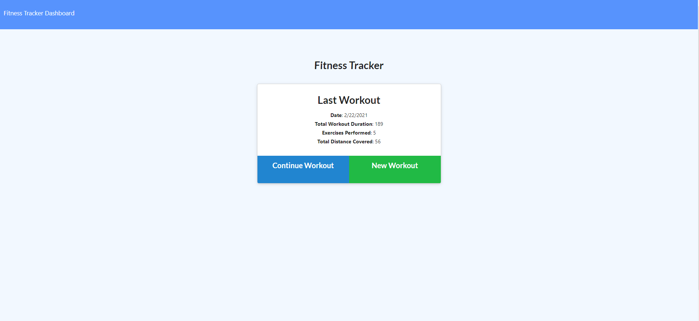
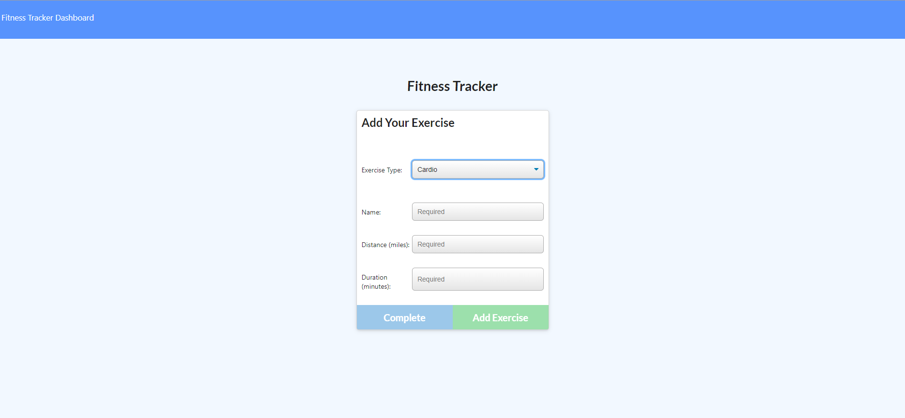
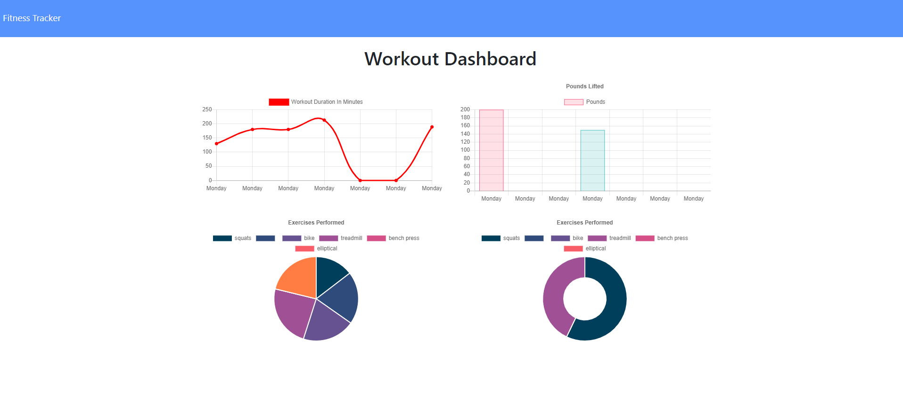

 # Workout-Tracker
For this assignment,  I have created a workout tracker that allows a user to view, create, and track daily workouts.   The user will be able to log multiple exercises in a workout on a given day.   The user will also be able to track the name, type, weight, sets, reps, and duration of exercise.   If the exercise is a cardio exercise, the user should be able to track their distance traveled.

## Acceptance Criteria

When the user loads the page, they should be given the option to create a new workout or continue with their last workout.

The user should be able to:

  * Add exercises to the most recent workout plan.

  * Add new exercises to a new workout plan.

  * View the combined weight of multiple exercises from the past seven workouts on the `stats` page.

  * View the total duration of each workout from the past seven workouts on the `stats` page.

## Tech Required: 
* VS Code
* MongoDB
* MongoDB Atlas
* NodeJS
  * Dependancies: 
    * Express
    * Mongoose
    * Morgan

* Heroku
* Github

## View Work: 
* https://drive.google.com/file/d/1vrRmewzrEDP3LpyKsTZsFtDtrxSbyoDV/view
* https://github.com/amcmilne/Workout-Tracker
* https://safe-bayou-15811.herokuapp.com/
  
### Screenshots: 

### GIF: 

 
 ## License
 * MIT

#### Contact Me: amcmilne@gmail.com